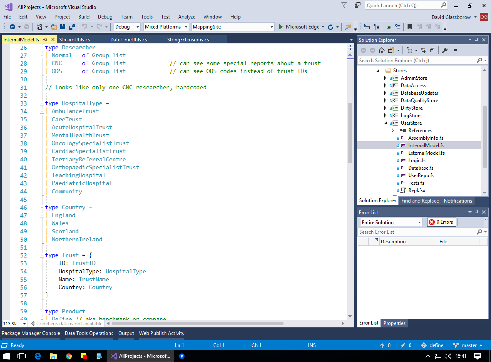

- title : Introduction to F#
- description : Introduction to F#
- author : Dave Glassborow
- theme : night
- transition : default

***

…you have to say to yourself:

 _“I don’t know what I’m doing. We, as a field, don’t know what we’re doing. We don’t know what programming is, we don’t know what computing is, we don’t even know what a computer is.”_
 
 And once you truly understand that, once you truly believe that – then you’re free, and you can think anything.

<br />

Bret Victor, [The Future of Programming](https://www.youtube.com/watch?v=8pTEmbeENF4)


***

## F# and <br> Functional Programming


---

## How I got here


---

## Why I care

- Fun learning something new
- Interesting technology from Microsoft
- Usable in my day to day job
- Makes my C# coding better

***

## F#

- ML (1974) / OCaml
- Open source since 2005
- Functional First but very pragmatic
- Full interop with C#
- Runs everywhere C# does + a few more

---

### Send an email C#

```csharp
using System.Net;
using System.Net.Mail;

public static class Emailer
{
  public static void SendTestEmail(string toEmail, string body)
  {
    var user = "dave.glassborow@myemail.co.uk";
    using (var msg = new MailMessage(user, toEmail))
    {
      msg.Subject = "Test";
      msg.Body = body;
      using(var client = new SmtpClient("smtp.office365.com",587))
      {
        client.EnableSsl = true;
        client.Credentials = new NetworkCredential(user, "****");
        client.Send(msg);
      }
    }
  }
}

Emailer.SendTestEmail( "dave@conceptfirst" "From Office365")
```
---

### Send an email F#

    open System.Net
    open System.Net.Mail

    /// Send email via office 365
    let sendTestEmail toEmail body =
        let user = "dave.glassborow@myemail.co.uk"
        use msg = new MailMessage(user,toEmail)
        msg.Subject <- "Test"
        msg.Body <- body 
        use client = new SmtpClient("smtp.office365.com",587)
        client.EnableSsl <- true  
        client.Credentials <- NetworkCredential(user,"****")
        client.Send(msg)

    //sendTestEmail "dave@conceptfirst" "From Office365"

---

- Whitespace
- Inference
- Superset of C#

---


---



---


***

## Functional programming

- _I have to think less, the compiler does more for me_
- Think _SQL Select_

---

_Controlling complexity is the essence of computer programming._


---

## Core values

- Seperate data and processes
- Transform into new data
- Sane defaults
- _Reason_ about code
- Composiblity: Lego
- Declarative
- Functions: first class, making them, changing them

---

_There are two ways of constructing a software design: One way is to make it so simple that there are obviously no deficiencies and the other way is to make it so complicated that there are no obvious deficiencies._

---

## Object Orientation

- _Object oriented programming makes code understandable by encapsulating moving parts. Functional programming makes code understandable by minimizing moving parts._

---

## Object Orientation

_The problem with object-oriented languages is they’ve got all this implicit environment that they carry around with them. You wanted a banana but what you got was a gorilla holding the banana and the entire jungle._

- Packets of hidden state, hard to reason about
- Things can change behind your back, especially in multi-threading
- Model with Subclassing, but not always worth the hassle ?

---

## Advantages

- Manage complexity
- Less stressful to code
- More powerful, program at a higher level
- Think differently, apply it to other langauges
- Pit of success
- REPL

--- 

## Disadvantages

- More abstract
- Mathematical naming
- Different way of thinking
- More thinking, less typing, which is harder
- Rabbit hole: Haskell, Dependant types, Category Theory

***

### F# features

    open System
    let simpleValue = 5
    let upper (s:string) = s.ToUpper()
    let fact      x      = List.reduce (fun total v -> v * total ) [1..x]
    let factorial x      = List.reduce (*) [1..x]
    let factorialPipe x  = [1..x] |> List.reduce (*)
    type Person = {
        Name: string
        Dob: DateTime option
    }

[F# cheatsheet](http://dungpa.github.io/fsharp-cheatsheet/)

---

## Pipelining

### C#

```csharp
public int AddOne(string x) =>
   int.Parse(x.Trim()) + 1;
```

### F#

```fsharp
let addOne(x:string) =
  x.Trim() |> Int32.Parse |> (+) 1
```

---

### Union types

    type Option<'t> =
    | None
    | Some of 't

    let getName name = match name with
                       | None      -> "-Unknown-"
                       | Some name -> name

    let person = Some "david"
    getName person |> printfn "%s"

---

### Union types

    type Suit = Clubs | Spades | Hearts | Diamonds
    type Rank = int

    type Score =
    | HighCard of Rank
    | OnePair of Rank
    | TwoPair of Higher:Rank * Lower:Rank
    | ThreeOfKind of Rank
    | Straight of High:Rank
    | Flush
    | FullHouse of Three:Rank * Two:Rank
    | FourOfKind of Rank
    | StraightFlush of High:Rank
    | RoyalFlush

    RoyalFlush > Flush

---

### Union types

    type Royal = Ace | King | Queen | Jack 

    let value hand =
        match hand with
        | Jack  -> 11
        | Queen -> 12
        | King  -> 13
        | Ace   -> 14

---
### Union types

    type PaymentType =
    | Cash
    | Cheque
    | CreditCard of Number:string * CCV:string
    | Bitcoin of key:string

---

### Record types

    type Person = { Name: string }

    { Name = "David" } = { Name = "David" }

---

### Units of measure

    [<Measure>] type m
    [<Measure>] type sec
    [<Measure>] type kg

    let distance = 1.0<m>
    let time = 2.0<sec>
    let speed = 2.0<m/sec>
    let acceleration = 2.0<m/sec^2>
    let force = 5.0<kg m/sec^2>
    let travel = time * speed

---

### Type Providers

- Databases (ORMS, querys, sprocs)
- Regular Expressions
- AWS S3 / Azure storage
- WMI
- OData
- Hadoop
- Slack
- [R](http://bluemountaincapital.github.io/FSharpRProvider/)

---

## REPL

- https://github.com/exeter-fp/poker-puzzle

***

## Where to use F#

- REPL
  - utilities
  - machine learning
  - exploring
- Complex
  - complex logic and domains
  - async code 
- Functional
  - pipelines
  - parsers

---

## Where NOT to use F#

- Basic mvc
- Xamarin

***

## Applying FP outside of FP

Applying functional thinkings to other languages

---

## F# -> C#

- Generics
- Nullable types
- LINQ
- Async/Await
- Tuples
- Pattern matching
- Record types
- Union types

---

- C# with static functions and dtos

```csharp
public class Person
{
    public string Email { get; set; }
    public string Name {get; set; }
}

public static class Emailer
{
    public static void SendEmail(Person who)
    {
        // emailing code ...
    }
}
```
---

## Javascript

- [Elm](http://elm-lang.org)
- [Fable](http://fable.io)
- [Ramda](http://ramdajs.com)
- [Purescript](http://www.purescript.org)

*** 

## Philisophy

- Logic, Sets, Programming
- Category theory
- Discovered  -or- the way we think?

***

## Find out more

### F#

- http://fsharpforfunandprofit.com
- http://connelhooley.uk/blog/2017/04/10/f-sharp-guide
- http://connelhooley.uk/blog/2017/04/30/f-sharp-to-c-sharp
- https://channel9.msdn.com/events/Build/2017/T6064
- [F# koans](https://github.com/ChrisMarinos/FSharpKoans/)
- [Video: F# for C# developers](https://vimeo.com/131640714)

--- 

## Find out more

### Functional Programming

- [John Carmack](http://www.altdev.co/2012/04/26/functional-programming-in-c/)
- [Rich Hickey](https://changelog.com/posts/rich-hickeys-greatest-hits)
- [Exeter FP Meetup](https://www.meetup.com/Exeter-Functional-Programmers/)
- [Lambdacast podcast](https://soundcloud.com/lambda-cast)

---

## Thought for the day

_Always code as if the guy who ends up maintaining your code will be a violent psychopath who knows where you live._
